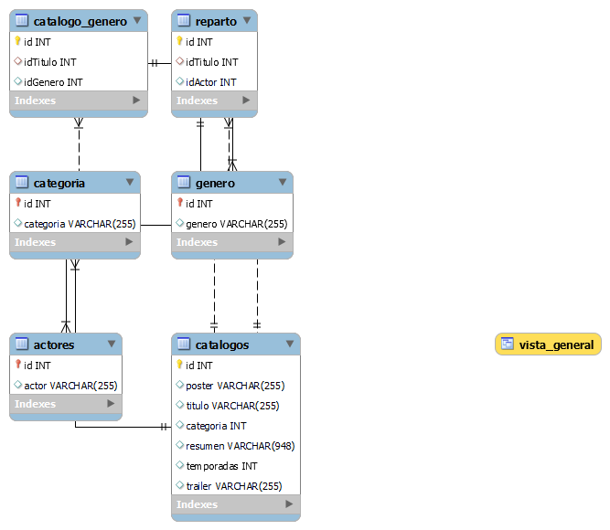

# API de Trailerfix con Node.js, Express y Sequelize

Esta es una API de ejemplo que utiliza Node.js, Express y Sequelize para listar los datos de una base de datas SQL,
  listarCatalogo,
  listarCatalogoId,
  listarCatalogoNombre,
  listarCatalogoCategoria,
  listarCatalogoActor 
   A continuación, encontrarás la documentación para utilizar esta API.


1 [Modelo - Entidad - Relación](#Modelo_Entidad_Relación)
*  [Requisitos Previos](#Requisitos_Previos)

2   [desarrollo](#desarrollo)
*  [obtener la vista sql](#obtener-catalogo)

*  [Listar todas las categorías](#obtener-todas-las-categorias)

*  [filtrar catalogo por id](#obtener-catalogo-por-id)

*  [filtrar catalogo por nombre](#obtener-catalogo-por-nombre)

*  [filtrar catalogo por categoria](#obtener-catalogo-por-categoria)

*  [filtrar actor por nombre](#obtener-actor-por-nombre)


3   [ end point del proyecto](#endpoint)

4   [ relacion de tablas](#relacion)


# Modelo_Entidad_Relación
## Modelo - Entidad - Relación


### Relaciones



# Requisitos_Previos
## Requisitos Previos

Asegúrate de tener Node.js y MySQL instalados en tu sistema antes de ejecutar la aplicación. Además, crea una base de datos MySQL y configura las credenciales en un archivo `.env` en la raíz del proyecto como se muestra en el siguiente ejemplo.

## Archivo `.env`

### Configuración de la base de datos
```plaintext
DB_HOST=localhost
DB_PORT=3000
DB_NAME=trailerfix
DB_USER=mi_usuario(root)
DB_PASSWORD=mi_contraseña_secreta_de_mysql
```
## Instalación

1. Clona este repositorio:

   ```bash
   git clone https://github.com/urldelproyecto...
   ```

2. Navega al directorio del proyecto:

   ```bash
   cd posts...
   ```

3. Instala las dependencias:

   ```bash
   npm install
   ```

4. Copia el archivo que esta en database_json (llamado crea_tablas_sql) y ejecutalo en el workbench,eso te creara la base de datos trailerfix con las correspondientes tablas y relaciones 

5. Inicia el servidor:

   ```bash
   node server
   ```

La API estará disponible en `http://localhost:3000`.


# desarrollo
## Endpoints

A continuación, se detallan los endpoints disponibles y cómo utilizarlos:


# obtener-catalogo
#### obtener la vista sql como el archivo datos.json

- **URL**: `/api/catalogo`
- **Método**: `GET`
- **Respuesta Exitosa**:
  - **Código**: 200 OK
  - **Ejemplo de Respuesta**:

 ``` json

         
         {
      "id": 1,
      "poster": "http://localhost:3000/api/posters/1.jpg",
      "titulo": "The Crown",
      "categoria": "Serie",
      "genero": "Drama,Hechos verídicos",
      "resumen": "Este drama narra las rivalidades políticas y el romance de la reina Isabel II, así como los sucesos que moldearon la segunda mitad del siglo XX.",
      "temporadas": 4,
      "reparto": "Claire Fox,Helena Bonham Carter,Matt Smith,Olivia Colman,Tobias Menzies,Vanesa Kirby",
      "trailer": ""
        }
        
   ```


# obtener-todas-las-categorias
#### Listar todas las categorías

- **URL**: `/api/categoria`
- **Método**: `GET`
- **Respuesta Exitosa**:
  - **Código**: 200 OK
  - **Ejemplo de Respuesta**:

``` json
    [
     {
      "id": 1,
     "categoria": "Serie"
     },
     {
     "id": 2,
     "categoria": "Película"
              }]
```

# obtener-catalogo-por-id
#### Obtener un catalogo por ID

- **URL**: `/api/catalogo/id/:id`
- **Método**: `GET`
- **Respuesta Exitosa**:
  - **Código**: 200 OK
  - **Ejemplo de Respuesta**:
  - 
```json
 {
    "id": 1,
   "poster": "/posters/1.jpg",
   "titulo": "The Crown",
    "categoria": true,
    "resumen": "Este drama narra las rivalidades políticas y el romance de la reina Isabel II, así como los sucesos que moldearon la segunda mitad del siglo XX.",
  "temporadas": 4,
  "trailer": "",
  "Categoria": {
    "id": 1,
    "categoria": "Serie"
     },
  "Actores": [
    {
      "id": 25,
      "actor": "Claire Fox",
      "Reparto": {
        "id": 25,
        "idTitulo": 1,
        "idActor": 25
      }
    },
    {
      "id": 26,
      "actor": "Olivia Colman",
      "Reparto": {
        "id": 26,
        "idTitulo": 1,
        "idActor": 26
      }
    },
    {
      "id": 27,
      "actor": "Matt Smith",
      "Reparto": {
        "id": 27,
        "idTitulo": 1,
        "idActor": 27
      }
    },
    {
      "id": 28,
      "actor": "Tobias Menzies",
      "Reparto": {
        "id": 28,
        "idTitulo": 1,
        "idActor": 28
      }
    },
    {
      "id": 29,
      "actor": "Vanesa Kirby",
      "Reparto": {
        "id": 29,
        "idTitulo": 1,
        "idActor": 29
      }
    },
    {
      "id": 30,
      "actor": "Helena Bonham Carter",
      "Reparto": {
        "id": 30,
        "idTitulo": 1,
        "idActor": 30
      }
    }
  ],
  "Generos": [
    {
      "id": 3,
      "genero": "Drama",
      "Catalogo_Genero": {
        "id": 11,
        "idTitulo": 1,
        "idGenero": 3
      }
    },
    {
      "id": 7,
      "genero": "Hechos verídicos",
      "Catalogo_Genero": {
        "id": 12,
        "idTitulo": 1,
        "idGenero": 7
      }
    }
  ]
  }
  ```

# obtener-catalogo-por-nombre
#### filtrar catalogo por nombre (filtro like)  

- **URL**: `/api/catalogo/nombre/:nombre`
- **Método**: `GET`
- **Respuesta Exitosa**:
  - **Código**: 200 OK
  - **Ejemplo de Respuesta**:

```json
      [
        {
    "id": 1,
    "poster": "/posters/1.jpg",
    "titulo": "The Crown",
    "categoria": true,
    "resumen": "Este drama narra las rivalidades políticas y el romance de la reina Isabel II, así como los sucesos que moldearon la segunda mitad del siglo XX.",
    "temporadas": 4,
    "trailer": ""
    }]
    ```

# obtener-catalogo-por-categoria
#### filtrar catalogo por categoria (filtro like)

- **URL**: `/api/catalogo/categoria/pelicula`
- **Método**: `GET`
- **Respuesta Exitosa**:
  - **Código**: 200 OK
  - **Ejemplo de Respuesta**:

    ```json
          {
    "id": 6,
    "poster": "/posters/6.jpg",
    "titulo": "Enola Holmes",
    "categoria": 2,
    "resumen": "La hermana menor de Sherlock, descubre que su madre ha desaparecido y se dispone a encontrarla. En su búsqueda, saca a relucir el sabueso que corre por sus venas y se encuentra con una conspiración que gira en torno a un misterioso lord, demostrando que su ilustre hermano no es el único talento en la familia.",
    "temporadas": 0,
    "trailer": "",
    "Categoria": {
      "id": 2,
      "categoria": "Película"
    },
    "Actores": [
      {
        "id": 31,
        "actor": "Millie Bobby Brown",
        "Reparto": {
          "id": 31,
          "idTitulo": 6,
          "idActor": 31
        }
      },
      {
        "id": 32,
        "actor": "Henry Cavill",
        "Reparto": {
          "id": 32,
          "idTitulo": 6,
          "idActor": 32
        }
      },
      {
        "id": 33,
        "actor": "Sam Claflin",
        "Reparto": {
          "id": 33,
          "idTitulo": 6,
          "idActor": 33
        }
      },
      {
        "id": 30,
        "actor": "Helena Bonham Carter",
        "Reparto": {
          "id": 34,
          "idTitulo": 6,
          "idActor": 30
        }
      },
      {
        "id": 34,
        "actor": "Louis Partridge",
        "Reparto": {
          "id": 35,
          "idTitulo": 6,
          "idActor": 34
        }
      },
      {
        "id": 35,
        "actor": "Adeel Akhtar",
        "Reparto": {
          "id": 36,
          "idTitulo": 6,
          "idActor": 35
        }
      }
    ],
    "Generos": [
      {
        "id": 4,
        "genero": "Ficción",
        "Catalogo_Genero": {
          "id": 13,
          "idTitulo": 6,
          "idGenero": 4
        }
      },
      {
        "id": 3,
        "genero": "Drama",
        "Catalogo_Genero": {
          "id": 14,
          "idTitulo": 6,
          "idGenero": 3
        }
      },
      {
        "id": 6,
        "genero": "Misterio",
        "Catalogo_Genero": {
          "id": 15,
          "idTitulo": 6,
          "idGenero": 6
        }
      }
    ]
      }

    ```

# obtener-actor-por-nombre
#### buscar actor por nombre(filtro like)

- **URL**: `/api/catalogo/actor/Brett`
- **Método**: `GET`


- **Respuesta Exitosa**:
  - **Código**: 200 OK
  - **Ejemplo de Respuesta**:
  ```json
    [
    {
    "id": 3,
    "poster": "/posters/3.jpg",
    "titulo": "The Mandalorian",
    "categoria": true,
    "resumen": "Ambientada tras la caída del Imperio y antes de la aparición de la Primera Orden, la serie sigue los pasos de un pistolero solitario en las aventuras que protagoniza en los confines de la galaxia, donde no alcanza la autoridad de la Nueva República.",
    "temporadas": 2,
    "trailer": "https://www.youtube.com/embed/aOC8E8z_ifw",
    "Actores": [
      {
        "id": 1,
        "actor": "Pedro Pascal",
        "Reparto": {
          "id": 1,
          "idTitulo": 3,
          "idActor": 1
        }
      }
    ]
  }
    ]
  ```


# relacion
## Tabla `catalogo_Genero`

La tabla `catalogo_Genero` se utiliza para mantener un registro de las relaciones entre las catalogo y las genero. Esta tabla es esencial para implementar una relación de uno  a muchos entre las titulos y los generos, ya que permite asociar múltiples generos a un titulo.

### Esquema de la tabla

| Campo         | Tipo   | Descripción                                                   |
| ------------- | ------ | ------------------------------------------------------------- |
| `id`          | Entero | Identificador único de la relación.                           |
| `idTitulo`     | Entero | Clave foránea que hace referencia a la tabla `catalogo`. |
| `idGenero` | Entero | Clave foránea que hace referencia a la tabla `genero`.     |

### Relaciones

- `idTitulo`: Esta columna se relaciona con la tabla `catalogo` y representa el titulo a la que se asocia a un genero.
- `idGenero`: Esta columna se relaciona con la tabla `genero` y representa el genero asociada a una pelicula.

### Ejemplo de uso

Supongamos que tenemos las siguientes entradas en la tabla `Catalogo_Genero`:

| id  | idTitulo | idGenero |
| --- | ------- | ----------- |
| 1   | 1     | 1           |
| 2   | 1     | 3           |
| 3   | 2     | 1           |

Esto indica que:
- la pelicula con `id` 1 está asociada al genero con `id` 1.
- La pelicula con `id` 1 está asociada al genero con `id` 3.
- La pelicula con `id` 3 está asociada a al genero con `id` 1.


La API devuelve mensajes de error con los códigos de estado correspondientes en caso de que ocurran problemas. Asegúrate de manejar adecuadamente estos errores en tu aplicación cliente.

## Conclusiones

Esta es una API de ejemplo que utiliza Node.js, Express y Sequelize para listar por vista,catalogo, id,nombre,categorias,actor,generos. 

el archivo json esta en la carpeta db/datos.json


